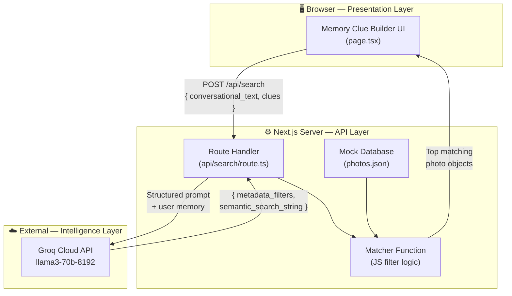
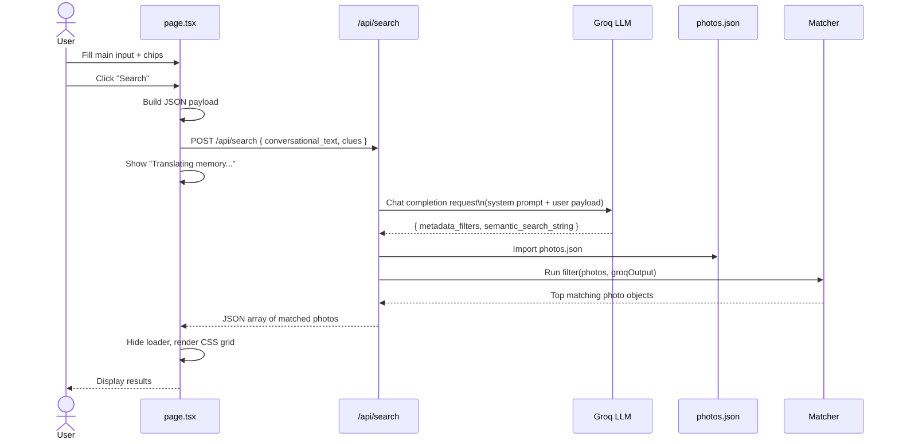
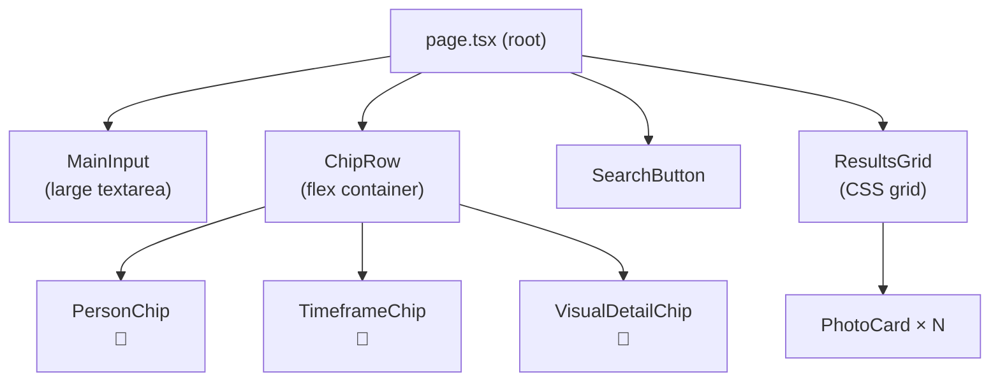
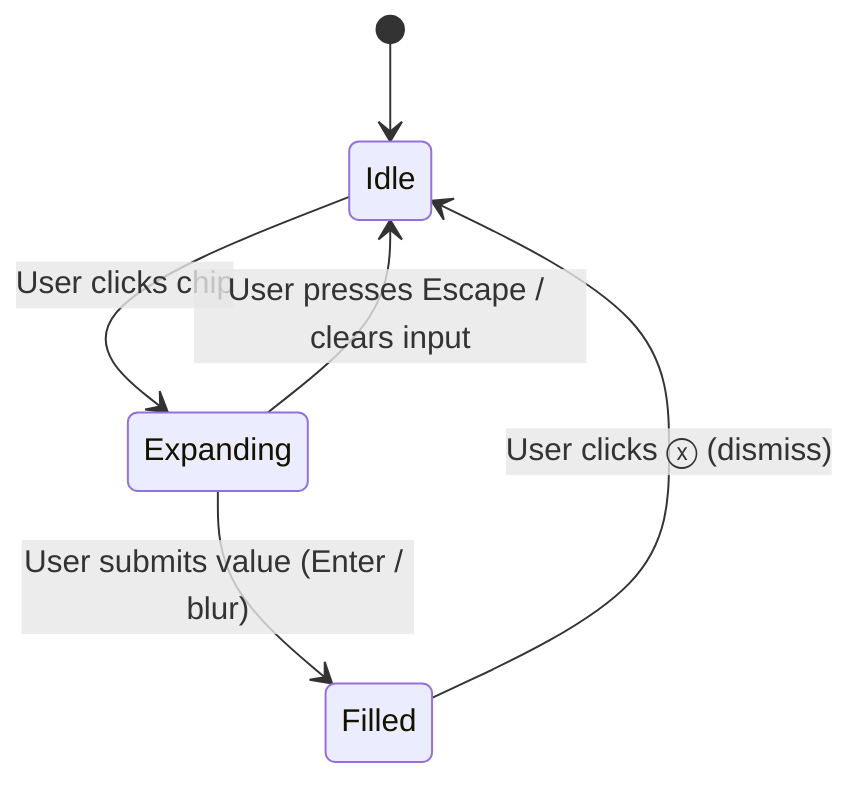

# Architecture — Guided "Memory Clue" Builder MVP

> **Tech Stack:** Next.js 14 (App Router) · React · Tailwind CSS · Groq API (`@groq/groq-sdk`)

---

## Table of Contents

1. [System Overview](#1-system-overview)
2. [Directory Structure](#2-directory-structure)
3. [Layer Breakdown](#3-layer-breakdown)
   - [Presentation Layer — Frontend](#31-presentation-layer--frontend)
   - [API Layer — Next.js Route Handler](#32-api-layer--nextjs-route-handler)
   - [Intelligence Layer — Groq LLM](#33-intelligence-layer--groq-llm)
   - [Data Layer — Mock Database](#34-data-layer--mock-database)
   - [Matcher Layer — Filtering Engine](#35-matcher-layer--filtering-engine)
4. [Data Flow](#4-data-flow)
5. [Component Architecture](#5-component-architecture)
6. [State Machine — Chip Lifecycle](#6-state-machine--chip-lifecycle)
7. [API Contract](#7-api-contract)
8. [LLM Translation Design](#8-llm-translation-design)
9. [Matching Algorithm](#9-matching-algorithm)
10. [Environment & Configuration](#10-environment--configuration)
11. [Key Design Decisions](#11-key-design-decisions)

---

## 1. System Overview

The system is a **single-page Next.js application** that replaces a traditional static search bar with a structured, multi-signal query builder. It pipelines user input through an LLM translation layer before filtering a local photo database.



---

## 2. Directory Structure

```
src/
├── app/
│   ├── page.tsx                  # Main UI — Memory Clue Builder
│   ├── layout.tsx                # Root layout
│   └── api/
│       └── search/
│           └── route.ts          # POST handler — LLM + Matcher
├── data/
│   └── photos.json               # Hardcoded mock photo database (20 entries)
└── components/                   # (optional) Chip, ResultGrid, etc.

docs/
├── problemStatement.md           # Project requirements & context
└── architecture.md               # This file
```

---

## 3. Layer Breakdown

### 3.1 Presentation Layer — Frontend

**File:** `src/app/page.tsx`

Responsible for rendering the scaffolded query builder and managing all UI state locally (React `useState`).

| UI Element | Role |
|---|---|
| Main Text Input | Free-form conversational memory capture |
| Person Chip | Named individual structured input |
| Timeframe Chip | Temporal signal (season, year, month) |
| Visual Detail Chip | Objects, colors, textures, actions |
| Dynamic Placeholder | Contextual prompt that guides the user |
| Search Button | Triggers payload construction & API call |
| Loading State | `"Translating memory..."` shown during fetch |
| Results Grid | CSS grid of returned photo cards |

---

### 3.2 API Layer — Next.js Route Handler

**File:** `src/app/api/search/route.ts`

A **Next.js App Router Route Handler** that acts as the backend orchestrator.

**Responsibilities:**
- Accept the `POST /api/search` request with the user payload
- Construct and send a system-prompted request to the Groq API
- Parse the structured JSON response from Groq
- Pass the parsed query to the Matcher
- Return the matched photo objects to the client

**Groq SDK Init:**
```ts
import Groq from "@groq/groq-sdk";
const groq = new Groq({ apiKey: process.env.GROQ_API_KEY });
```

---

### 3.3 Intelligence Layer — Groq LLM

**Model:** `llama3-70b-8192` (fallback: `mixtral-8x7b-32768`)  
**Mode:** JSON-only output enforced via `response_format: { type: "json_object" }`

Acts as a **semantic translation engine**: converts raw, fuzzy human memory into a structured, machine-readable query.

**Transformations performed:**

| Raw User Input | LLM Output |
|---|---|
| `"Summer 2022"` | `"2022-06-01 to 2022-08-31"` (date range) |
| `"eating something messy"` | `"food, dirty, eating"` (visual tags) |
| `"the beach trip with Sarah"` | `people: ["Sarah"], location_inference: ["beach"]` |
| Missing field | `null` |

---

### 3.4 Data Layer — Mock Database

**File:** `src/data/photos.json`

A static JSON array of **20 photo objects** imported at runtime by the route handler. No database or external storage is used.

**Schema:**

```ts
type Photo = {
  id: string;
  url: string;           // Unsplash image URL
  metadata: {
    people: string[];    // Named individuals
    date: string;        // ISO 8601 (YYYY-MM-DD)
    location: string;    // Freeform location label
  };
  visual_tags: string[]; // Descriptive tags for semantic matching
};
```

**Coverage targets for the 20 photos:**

| Dimension | Variety |
|---|---|
| People | 6–8 distinct names |
| Seasons | Spring, Summer, Autumn, Winter |
| Locations | Beach, mountains, indoor, city, park, etc. |
| Actions | Dining, hiking, celebrating, playing, travelling |
| Visual cues | Food, clothing colors, lighting, decor |

---

### 3.5 Matcher Layer — Filtering Engine

**Location:** inline in `src/app/api/search/route.ts`

A lightweight, synchronous JavaScript function that scores and filters photos against the structured Groq output.

**Algorithm (two-pass filter):**

```
Pass 1 — People Filter (hard filter, if provided):
  Keep photo if ANY name in metadata_filters.people
  appears in photo.metadata.people (case-insensitive)

Pass 2 — Semantic Filter (soft match):
  Tokenize semantic_search_string into individual keywords
  Keep photo if ANY keyword appears in ANY of photo.visual_tags
  (case-insensitive substring match)

Output: union of Pass 1 ∩ Pass 2 results, or best partial matches
```

---

## 4. Data Flow

A complete trace of a single user interaction:



---

## 5. Component Architecture



Each **Chip** manages its own 3-state lifecycle (see §6) while surfacing its value up to `page.tsx` via a callback.

---

## 6. State Machine — Chip Lifecycle

Each chip independently cycles through three states:



| State | Visual | Value |
|---|---|---|
| `Idle` | `[+ 📅 Timeframe]` | `null` |
| `Expanding` | Inline text input visible | `""` (editing) |
| `Filled` | `[📅 Summer 2022 ⓧ]` | `"Summer 2022"` |

**Dynamic placeholder logic** in `MainInput` reads the set of filled chips and updates accordingly:

| Chips Filled | Placeholder |
|---|---|
| None | `"What do you remember? Type anything..."` |
| Timeframe only | `"You've added a time. Who was there?"` |
| Person only | `"Great! What do you remember happening?"` |
| Person + Timeframe | `"Add a visual detail to narrow it down."` |
| All filled | `"You're all set — hit Search!"` |

---

## 7. API Contract

### Request

```
POST /api/search
Content-Type: application/json
```

```ts
type SearchRequest = {
  conversational_text: string;
  clues: {
    person: string | null;
    timeframe: string | null;
    visual_detail: string | null;
  };
};
```

### Response (Success)

```
200 OK
Content-Type: application/json
```

```ts
type SearchResponse = Photo[]; // Array of matched photo objects
```

### Response (Error)

```
500 Internal Server Error
{ "error": "string" }
```

---

## 8. LLM Translation Design

### System Prompt

```
You are the query translation engine for a photo retrieval system.
Translate the user's fragmented memory (conversational text + structured clues)
into a JSON search query.

RULES:
1. Expand vague temporal terms (e.g., "Summer 2022" -> "2022-06-01 to 2022-08-31").
2. Translate abstract activities into concrete visual realities
   (e.g., "eating something messy" -> "food, dirty, eating").
3. If a variable is missing, output null.

OUTPUT FORMAT (Valid JSON only):
{
  "metadata_filters": {
    "people": ["array of strings"],
    "location_inference": ["array of strings"]
  },
  "semantic_search_string": "comma-separated string combining visual details and actions"
}
```

### User Message Shape

The user message passed to Groq is constructed from the `SearchRequest`:

```json
{
  "conversational_text": "We were eating something messy outside",
  "clues": {
    "person": "Sarah",
    "timeframe": "Summer 2022",
    "visual_detail": "red tablecloth"
  }
}
```

### Expected Groq Output

```json
{
  "metadata_filters": {
    "people": ["Sarah"],
    "location_inference": ["outdoor", "beach", "park"]
  },
  "semantic_search_string": "eating messy food, outdoor dining, red tablecloth, summer"
}
```

---

## 9. Matching Algorithm

```ts
function matchPhotos(photos: Photo[], groqOutput: GroqOutput): Photo[] {
  const { metadata_filters, semantic_search_string } = groqOutput;
  const keywords = semantic_search_string
    ?.toLowerCase()
    .split(",")
    .map(k => k.trim()) ?? [];

  return photos.filter(photo => {
    // Pass 1 — People match (hard filter, only if people were specified)
    const peopleMatch =
      !metadata_filters.people?.length ||
      metadata_filters.people.some(name =>
        photo.metadata.people.map(p => p.toLowerCase()).includes(name.toLowerCase())
      );

    // Pass 2 — Semantic keyword overlap with visual_tags
    const semanticMatch =
      !keywords.length ||
      keywords.some(keyword =>
        photo.visual_tags.some(tag => tag.toLowerCase().includes(keyword))
      );

    return peopleMatch && semanticMatch;
  });
}
```

> [!NOTE]
> If both filters produce no results, consider relaxing to OR logic (people OR semantic) to avoid empty states.

---

## 10. Environment & Configuration

| Variable | Description | Required |
|---|---|---|
| `GROQ_API_KEY` | Groq Cloud API key | ✅ Yes |

Create a `.env.local` file at the project root:

```env
GROQ_API_KEY=gsk_xxxxxxxxxxxxxxxxxxxxxxxxxxxxxxxx
```

> [!CAUTION]
> Never commit `.env.local` to version control. Ensure it is listed in `.gitignore`.

---

## 11. Key Design Decisions

| Decision | Rationale |
|---|---|
| **LLM as translation layer, not ranker** | Keeps LLM role narrow and predictable; avoids hallucinated rankings |
| **JSON mode enforced** | Eliminates need for brittle regex parsing of LLM output |
| **Hardcoded JSON DB** | Removes infrastructure complexity for MVP; easy to swap with a real DB later |
| **Chip-based UI** | Scaffolds user input without overwhelming them; each chip is optional |
| **Dynamic placeholder** | Creates a conversational feel and guides users to fill more signal |
| **Client-side state only** | No auth, sessions, or server state needed for MVP scope |
| **Keyword substring match** | Simple, fast, zero-dependency; good enough for 20-record dataset |
