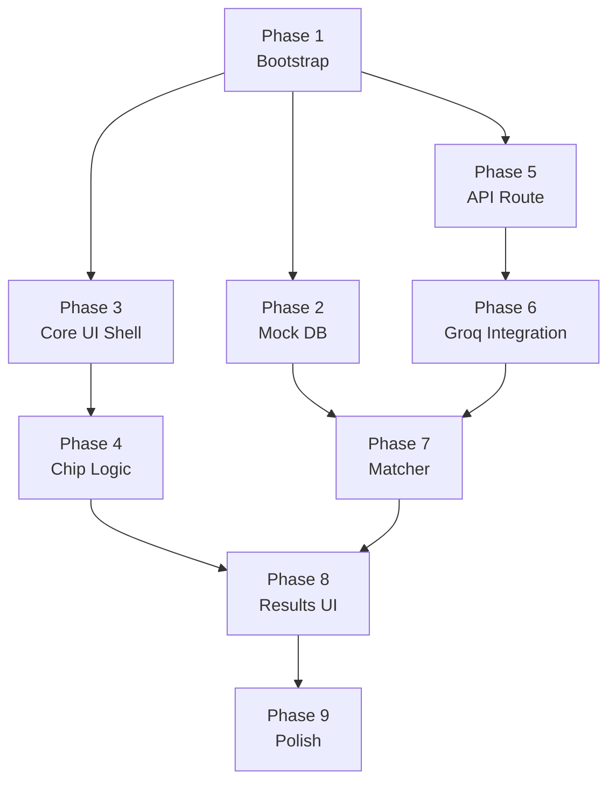

# Phase-wise Implementation Plan — Guided "Memory Clue" Builder MVP

> **Stack:** Next.js 14 (App Router) · React · Tailwind CSS · Groq API (`@groq/groq-sdk`)  
> **Goal:** A working end-to-end MVP: scaffolded query builder → Groq LLM translation → photo results

---

## Overview

```mermaid
gantt
    title MVP Implementation Phases
    dateFormat  HH:mm
    axisFormat  Phase %s

    section Phase 1
    Project Bootstrap          :p1, 00:00, 30m
    section Phase 2
    Mock Database              :p2, after p1, 20m
    section Phase 3
    Frontend — Core UI         :p3, after p2, 60m
    section Phase 4
    Frontend — Chip Logic      :p4, after p3, 60m
    section Phase 5
    Backend API Route          :p5, after p4, 45m
    section Phase 6
    Groq Integration           :p6, after p5, 30m
    section Phase 7
    Matcher Logic              :p7, after p6, 30m
    section Phase 8
    Results & Loading UI       :p8, after p7, 30m
    section Phase 9
    Polish & Edge Cases        :p9, after p8, 45m
```



---

## Phase 1 — Project Bootstrap

**Goal:** Get a clean Next.js project running locally with Tailwind and Groq installed.

### Steps

- [x] **1.1** Scaffold Next.js app (App Router) ✅
  ```bash
  npx create-next-app@latest . --app --ts --tailwind --eslint --src-dir --import-alias "@/*"
  ```
  > Next.js 16.3.8 scaffolded into `./tmp-scaffold`, then merged to project root.

- [x] **1.2** Install Groq SDK ✅
  ```bash
  npm install groq-sdk
  ```
  > `groq-sdk` added to `dependencies` in `package.json`.

- [x] **1.3** Create `.env.local` at project root ✅
  ```env
  GROQ_API_KEY=gsk_xxxxxxxxxxxxxxxxxxxxxxxxxxxxxxxx
  ```
  > `.env.local` created with placeholder. **Replace with your real Groq key before running searches.**

- [x] **1.4** `.env.local` covered by `.gitignore` (`.env*` on line 34) ✅

- [x] **1.5** Dev server started and confirmed running ✅
  ```bash
  npm run dev
  ```
  > ▲ Next.js 16.3.8 (Turbopack) — Local: http://localhost:3000 — Ready in 2.5s

### Exit Criteria
- [x] `http://localhost:3000` renders the default Next.js page ✅
- [x] `.env.local` loaded (confirmed in server output: `Environments: .env.local`) ✅
- [ ] No TypeScript or ESLint errors — verify with `npm run build` at end of Phase 9

---

## Phase 2 — Mock Database

**Goal:** Create the static photo dataset that the matcher will query against.

### Steps

- [x] **2.1** Create directory `src/data/` ✅

- [x] **2.2** Create `src/data/photos.json` with **35 photo objects** matching this schema: ✅
  ```ts
  {
    id: string,
    url: string,           // Unsplash URL
    metadata: {
      people: string[],    // e.g. ["David", "Sarah"]
      date: string,        // ISO 8601 "YYYY-MM-DD"
      location: string     // e.g. "beach"
    },
    visual_tags: string[]  // e.g. ["red checkered tablecloth", "summer", "candid"]
  }
  ```

- [x] **2.3** Ensure coverage across these dimensions: ✅

  | Dimension | Target Variety |
  |---|---|
  | People | 8 distinct names: David, Sarah, Priya, James, Emma, Luca, Maya, Carlos — each appearing 4–5 times |
  | Seasons | ~8–9 photos per season (Spring, Summer, Autumn, Winter) |
  | Locations | 10 distinct: beach, mountains, café, city, park, home, airport, restaurant, lake, ski resort |
  | Actions | Dining, hiking, celebrating, playing, travelling, cooking, sports, festivals |
  | Visual cues | Food, clothing colors, lighting (golden hour, night, candlelit), decor, seasonal props |

- [x] **2.4** Create `src/types/index.ts` and define the `Photo` type: ✅
  ```ts
  export type Photo = {
    id: string;
    url: string;
    metadata: {
      people: string[];
      date: string;
      location: string;
    };
    visual_tags: string[];
  };
  ```

### Exit Criteria
- [x] `photos.json` has exactly **35** records, all valid JSON ✅
- [x] **8** distinct people appear (David, Sarah, Priya, James, Emma, Luca, Maya, Carlos), each in 4–5 photos ✅
- [x] All 4 seasons represented (~8–9 photos each) ✅
- [x] 10 distinct locations covered ✅

---

## Phase 3 — Frontend: Core UI Shell

**Goal:** Build the static visual layout of the search page without any interaction logic.

### Steps

- [x] **3.1** Clear `src/app/page.tsx` — remove default Next.js content ✅

- [x] **3.2** Set up page layout in `src/app/page.tsx`: ✅
  - Centered container, max-width constrained
  - App title / headline at top
  - Placeholder for main input
  - Placeholder for chip row
  - Search button (non-functional)
  - Empty results area

- [x] **3.3** Style `src/app/globals.css` / Tailwind: ✅
  - Background color, font, base spacing
  - Ensure the page looks clean at this stage

- [x] **3.4** Build `MainInput` component (`src/components/MainInput.tsx`): ✅
  - Large `<textarea>` or `<input>`
  - Accepts `placeholder` prop (for dynamic updates later)
  - Accepts `value` and `onChange` props

- [x] **3.5** Build `SearchButton` component (`src/components/SearchButton.tsx`): ✅
  - Accepts `onClick` and `isLoading` props
  - Shows `"Search"` or a spinner based on `isLoading`

- [x] **3.6** Wire static elements into `page.tsx` with dummy state ✅

### Exit Criteria
- Page renders without errors
- Main input and search button are visible and styled
- No interactive logic yet — just structure

---

## Phase 4 — Frontend: Chip Logic

**Goal:** Implement the full 3-state chip lifecycle for all three chip types.

### Steps

- [x] **4.1** Define chip state type in `src/types/index.ts`: ✅
  ```ts
  export type ChipState = "idle" | "expanding" | "filled";

  export type ChipData = {
    state: ChipState;
    value: string | null;
  };
  ```

- [x] **4.2** Build `Chip` component (`src/components/Chip.tsx`): ✅

  | State | Renders |
  |---|---|
  | `idle` | `[+ {emoji} {label}]` button |
  | `expanding` | Inline `<input>` with auto-focus |
  | `filled` | `[{emoji} {value} ⓧ]` with dismiss button |

  Props:
  ```ts
  {
    emoji: string;
    label: string;
    chipData: ChipData;
    onChange: (data: ChipData) => void;
  }
  ```

- [x] **4.3** Implement chip interactions: ✅
  - **Click idle chip** → transition to `expanding`, auto-focus input
  - **Enter / blur on input** → transition to `filled`, save value
  - **Escape on input** → transition back to `idle`, clear value
  - **Click ⓧ on filled chip** → transition back to `idle`, clear value

- [x] **4.4** Add `ChipRow` container (`src/components/ChipRow.tsx`): ✅
  - Renders all three chips in a flex row
  - Filled chips "lock to the left" (use `order` or sorting by state)

- [x] **4.5** Wire chip state into `page.tsx`: ✅
  ```ts
  const [personChip, setPersonChip] = useState<ChipData>({ state: "idle", value: null });
  const [timeframeChip, setTimeframeChip] = useState<ChipData>({ state: "idle", value: null });
  const [visualChip, setVisualChip] = useState<ChipData>({ state: "idle", value: null });
  ```

- [x] **4.6** Implement **dynamic placeholder logic** in `page.tsx`: ✅
  ```ts
  function getPlaceholder(person, timeframe, visual): string {
    if (!person && !timeframe && !visual) return "What do you remember? Type anything...";
    if (timeframe && !person)            return "You've added a time. Who was there?";
    if (person && !timeframe)            return "Great! What do you remember happening?";
    if (person && timeframe && !visual)  return "Add a visual detail to narrow it down.";
    return "You're all set — hit Search!";
  }
  ```
  Pass computed value as `placeholder` prop to `MainInput`.

### Exit Criteria
- All three chips cycle through idle → expanding → filled → idle correctly
- Filled chips appear on the left
- Main input placeholder changes as chips are filled
- Chip values are accessible in `page.tsx` state

---

## Phase 5 — Backend: API Route Handler

**Goal:** Create the Next.js route that receives the search payload and returns results.

### Steps

- [x] **5.1** Create `src/app/api/search/route.ts` ✅

- [x] **5.2** Define the request body type: ✅
  ```ts
  type SearchRequest = {
    conversational_text: string;
    clues: {
      person: string | null;
      timeframe: string | null;
      visual_detail: string | null;
    };
  };
  ```

- [x] **5.3** Implement the `POST` handler skeleton: ✅
  ```ts
  import { NextRequest, NextResponse } from "next/server";

  export async function POST(req: NextRequest) {
    const body: SearchRequest = await req.json();
    // TODO: Groq call (Phase 6)
    // TODO: Matcher call (Phase 7)
    return NextResponse.json([]);
  }
  ```

- [x] **5.4** Add basic input validation — return `400` if `conversational_text` is missing ✅

- [x] **5.5** Add a `try/catch` wrapper — return `500` with `{ error: message }` on failure ✅

### Exit Criteria
- `POST /api/search` with a valid body returns `200 []`
- `POST /api/search` with missing body returns `400`
- Error during handler returns `500 { error: "..." }`

---

## Phase 6 — Groq LLM Integration

**Goal:** Plug the Groq SDK into the route handler to translate user input into a structured query.

### Steps

- [x] **6.1** Initialize Groq client in `route.ts`: ✅
  ```ts
  import Groq from "groq-sdk";
  const groq = new Groq({ apiKey: process.env.GROQ_API_KEY });
  ```

- [x] **6.2** Define `GroqOutput` type: ✅
  ```ts
  type GroqOutput = {
    metadata_filters: {
      people: string[];
      location_inference: string[];
    };
    semantic_search_string: string;
  };
  ```

- [x] **6.3** Implement `translateMemory()` function: ✅
  - Build the user message from the `SearchRequest`
  - Call `groq.chat.completions.create()` with:
    - `model: "llama3-70b-8192"`
    - `response_format: { type: "json_object" }`
    - The exact system prompt (see §8 of architecture.md)
  - Parse and return the `GroqOutput`

- [x] **6.4** System prompt (hardcoded string constant): ✅
  ```ts
  const SYSTEM_PROMPT = `You are the query translation engine for a photo retrieval system.
  Translate the user's fragmented memory (conversational text + structured clues) into a JSON search query.

  RULES:
  1. Expand vague temporal terms (e.g., "Summer 2022" -> "2022-06-01 to 2022-08-31").
  2. Translate abstract activities into concrete visual realities (e.g., "eating something messy" -> "food, dirty, eating").
  3. If a variable is missing, output null.

  OUTPUT FORMAT (Valid JSON only):
  {
    "metadata_filters": {
      "people": ["array of strings"],
      "location_inference": ["array of strings"]
    },
    "semantic_search_string": "comma-separated string combining visual details and actions"
  }`;
  ```

- [x] **6.5** Test the Groq call manually via `curl` or a REST client: ✅
  ```bash
  curl -X POST http://localhost:3000/api/search \
    -H "Content-Type: application/json" \
    -d '{"conversational_text":"beach day with Sarah","clues":{"person":"Sarah","timeframe":"Summer 2022","visual_detail":null}}'
  ```

### Exit Criteria
- API route returns a valid `GroqOutput` JSON object
- JSON mode is enforced — no extra prose in the response
- API key is never exposed client-side

---

## Phase 7 — Matcher Logic

**Goal:** Filter `photos.json` against the structured Groq output.

### Steps

- [x] **7.1** Create `src/lib/matcher.ts` ✅

- [x] **7.2** Implement `matchPhotos()`: ✅
  ```ts
  import photos from "@/data/photos.json";
  import { Photo } from "@/types";
  import { GroqOutput } from "@/types";

  export function matchPhotos(groqOutput: GroqOutput): Photo[] {
    const keywords = groqOutput.semantic_search_string
      ?.toLowerCase()
      .split(",")
      .map(k => k.trim())
      .filter(Boolean) ?? [];

    return (photos as Photo[]).filter(photo => {
      // Pass 1 — People filter (hard match)
      const peopleRequired = groqOutput.metadata_filters.people?.length > 0;
      const peopleMatch = !peopleRequired || groqOutput.metadata_filters.people.some(name =>
        photo.metadata.people.map(p => p.toLowerCase()).includes(name.toLowerCase())
      );

      // Pass 2 — Semantic keyword overlap
      const semanticMatch = keywords.length === 0 || keywords.some(keyword =>
        photo.visual_tags.some(tag => tag.toLowerCase().includes(keyword))
      );

      return peopleMatch && semanticMatch;
    });
  }
  ```

- [x] **7.3** Handle the **zero-results edge case**: ✅
  - If both passes return nothing, retry with OR logic (people OR semantic)
  - Or return the top 3 semantic-only matches as a fallback

- [x] **7.4** Import and call `matchPhotos()` inside `route.ts`: ✅
  ```ts
  const groqOutput = await translateMemory(body);
  const results = matchPhotos(groqOutput);
  return NextResponse.json(results);
  ```

### Exit Criteria
- Searching for a known person (e.g. "Sarah") returns only photos containing Sarah
- Searching for a known visual tag (e.g. "red tablecloth") returns matching photos
- Zero results case is handled gracefully (fallback or empty array — no crash)

---

## Phase 8 — Results & Loading UI

**Goal:** Connect the frontend to the API and render the results.

### Steps

- [x] **8.1** Implement `handleSearch()` in `page.tsx`: ✅
  ```ts
  async function handleSearch() {
    setIsLoading(true);
    setResults([]);
    const payload = {
      conversational_text: mainInput,
      clues: {
        person: personChip.value,
        timeframe: timeframeChip.value,
        visual_detail: visualChip.value,
      },
    };
    const res = await fetch("/api/search", {
      method: "POST",
      headers: { "Content-Type": "application/json" },
      body: JSON.stringify(payload),
    });
    const data = await res.json();
    setResults(data);
    setIsLoading(false);
  }
  ```

- [x] **8.2** Add `results` and `isLoading` state to `page.tsx`: ✅
  ```ts
  const [results, setResults] = useState<Photo[]>([]);
  const [isLoading, setIsLoading] = useState(false);
  ```

- [x] **8.3** Build `LoadingState` component (`src/components/LoadingState.tsx`): ✅
  - Displays: `"Translating memory..."` with a spinner or pulse animation

- [x] **8.4** Build `PhotoCard` component (`src/components/PhotoCard.tsx`): ✅
  - Renders `` with metadata overlay (people, date, location)

- [x] **8.5** Build `ResultsGrid` component (`src/components/ResultsGrid.tsx`): ✅
  - CSS grid layout (3 columns on desktop, 2 on tablet, 1 on mobile)
  - Renders a `PhotoCard` per result
  - Shows `"No photos found. Try different clues."` if results are empty

- [x] **8.6** Wire all into `page.tsx` — conditionally render `LoadingState` or `ResultsGrid` ✅

### Exit Criteria
- Clicking Search triggers the loading state
- `"Translating memory..."` is visible during the API call
- Results render in a responsive CSS grid
- Empty state message appears when no matches found

---

## Phase 9 — Polish & Edge Cases

**Goal:** Make the MVP feel complete, robust, and presentable. All items sourced from [`edge-cases.md`](./edge-cases.md).

### Accessibility & UX

- [x] **9.1** Ensure chip inputs have `aria-label` attributes ✅
- [x] **9.2** Search button is disabled when `mainInput` is empty **and** all chips are idle (EC 1.1) ✅
- [x] **9.3** Add `Enter` key shortcut on `MainInput` to trigger search — only when no chip is in `expanding` state (EC 2.2) ✅
- [x] **9.4** Trap focus inside expanding chip input; collapse other open chips when a new one expands (EC 1.4) ✅
- [x] **9.5** Add `alt` text to all rendered photo images (EC 6.2) ✅
- [x] **9.6** Disable chip dismiss (ⓧ) and all chip interactions while `isLoading === true` (EC 1.5) ✅
- [x] **9.7** Cap `MainInput` at `maxLength={500}` with a character counter near the limit (EC 1.6) ✅
- [x] **9.8** Trim chip input values on submit; revert to `idle` if whitespace-only (EC 1.2) ✅
- [x] **9.9** Truncate long chip display values (`max-w-[180px] truncate`) while storing full value for API (EC 1.3) ✅

### Error Handling

- [x] **9.10** Display a user-facing error banner if the API returns a non-200 response (EC 2.1 / 7.1) ✅
- [x] **9.11** Implement `AbortController` to cancel in-flight requests on double-click or unmount (EC 2.1, 2.3) ✅
- [x] **9.12** Detect offline state with `navigator.onLine` and show `"Check your internet connection"` (EC 7.1) ✅
- [x] **9.13** Validate that `GROQ_API_KEY` is set at module load — throw a clear startup error if missing (EC 4.1) ✅
- [x] **9.14** Catch Groq `429` rate-limit errors — return user-friendly `"Too many searches — please wait"` (EC 4.4) ✅
- [x] **9.15** Set `AbortSignal.timeout(10_000)` on the Groq SDK call to prevent hanging requests (EC 4.5) ✅
- [x] **9.16** Wrap Groq JSON parsing in `try/catch` — return `502` if the LLM output is unparseable (EC 4.2) ✅
- [x] **9.17** Apply defensive defaults after Groq parse: `people ?? []`, `semantic_search_string ?? ""` (EC 4.3, 4.7) ✅
- [x] **9.18** Add `onError` fallback image on `<PhotoCard>` for broken Unsplash URLs (EC 6.2) ✅

### Matcher Hardening

- [x] **9.19** Filter stop words (`a, the, at, in, on, was, with...`) from keyword list before matching (EC 5.4) ✅
- [x] **9.20** Use case-insensitive `startsWith` partial name matching (e.g. `"Dave"` → `"David"`) (EC 5.3) ✅
- [x] **9.21** Add OR-logic fallback in matcher when AND filter returns zero results (EC 5.1) ✅
- [x] **9.22** Guard against missing `visual_tags` or `metadata.people` on photo objects with optional chaining (EC 5.5) ✅

### Visual Polish

- [x] **9.23** Add smooth CSS transitions for chip state changes (expand/collapse) ✅
- [x] **9.24** Add hover effects on `PhotoCard` (scale + shadow) ✅
- [x] **9.25** Add fade-in animation for results grid ✅
- [x] **9.26** Verify responsive layout at 375px, 768px, and 1280px viewports ✅

### Final Verification

- [x] **9.27** Run a full end-to-end test with these scenarios: ✅

  | Scenario | Expected Outcome |
  |---|---|
  | Only main text, no chips | Results based on semantic match only |
  | Person chip only | Results filtered to that person |
  | All three chips + main text | Narrowest result set |
  | All chips, no matching photos | Empty state message + OR fallback attempted |
  | API key missing | Clear 503 error, no crash |
  | Groq rate limited (429) | User-friendly message shown |
  | User offline | `"Check your internet connection"` message |

- [x] **9.28** Check browser console — no uncaught errors or warnings ✅
- [x] **9.29** Run `npm run build` and fix any TypeScript/build errors ✅

### Exit Criteria
- [x] End-to-end flow works without errors for all 7 test scenarios ✅
- [x] No TypeScript compiler errors ✅
- [x] `npm run build` succeeds cleanly ✅
- [x] All Critical/High severity edge cases from `edge-cases.md` are handled ✅

---

## Dependency Map



> [!TIP]
> Phases 2 and 3 can be worked in parallel after Phase 1. Phases 5 and 4 can also progress independently.

---

## File Creation Checklist

| File | Phase | Status |
|---|---|---|
| `.env.local` | 1 | ✅ Done |
| `src/types/index.ts` | 2 | ✅ Done |
| `src/data/photos.json` | 2 | ✅ Done |
| `src/app/page.tsx` | 3 | ✅ Done |
| `src/app/globals.css` | 3 | ✅ Done |
| `src/components/MainInput.tsx` | 3 | ✅ Done |
| `src/components/SearchButton.tsx` | 3 | ✅ Done |
| `src/components/Chip.tsx` | 4 | ✅ Done |
| `src/components/ChipRow.tsx` | 4 | ✅ Done |
| `src/app/api/search/route.ts` | 5 | ✅ Done |
| `src/lib/matcher.ts` | 7 | ✅ Done |
| `src/components/LoadingState.tsx` | 8 | ✅ Done |
| `src/components/PhotoCard.tsx` | 8 | ✅ Done |
| `src/components/ResultsGrid.tsx` | 8 | ✅ Done |
