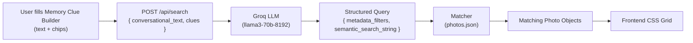

# Guided "Memory Clue" Builder MVP — Project Context

> **Tech Stack:** Next.js (App Router) · React · Tailwind CSS · Groq API (`@groq/groq-sdk`)

---

## 1. Problem Statement

Users self-censor their photo searches due to a **"trust deficit"** in AI capabilities — they don't believe the system will understand vague or fragmented memory. The result: poor recall and low engagement.

**Solution:** Replace the static search bar with a **dynamic, scaffolded query builder** that explicitly prompts users for multi-variable inputs:

| Input Type | Purpose |
|---|---|
| Free-text (conversational) | Capture raw memory fragments |
| 👤 Person | Named individuals present in the photo |
| 📅 Timeframe | Approximate date or season |
| 🎨 Visual Detail | Objects, colors, actions, textures |

These structured inputs are passed to a **Groq LLM** (acting as a translation layer) which converts them into a structured query, then matched against a hardcoded JSON mock database of photos.

---

## 2. Mock Database Schema — `src/data/photos.json`

A file of **20 diverse photo objects** using the following schema:

```json
[
  {
    "id": "1",
    "url": "https://images.unsplash.com/photo-1522071820081-009f0129c71c",
    "metadata": {
      "people": ["David", "Sarah"],
      "date": "2022-07-15",
      "location": "beach"
    },
    "visual_tags": [
      "red checkered tablecloth",
      "eating messy food",
      "sitting near water",
      "outdoor dining",
      "summer",
      "candid"
    ]
  }
]
```

Populate with varied data across different **people, seasons, actions, and locations**.

---

## 3. Frontend UI & State Logic — `src/app/page.tsx`

### Components

1. **Main Input** — Large text field  
   - Placeholder: `"What do you remember? Type anything..."`

2. **Dynamic Chips** — Three chips rendered below the input:
   - `[+ 👤 Add Person]`
   - `[+ 📅 Timeframe]`
   - `[+ 🎨 Visual Detail]`

### Chip Interaction Flow

```
Idle     →  [+ 📅 Timeframe]
Clicked  →  inline text input (expanded)
Filled   →  [📅 Summer 2022 ⓧ]  (collapses and locks to left)
```

- Filled chips are **dismissable** via the ⓧ button.
- The **main input placeholder updates dynamically** to guide the user:
  - After adding a timeframe: `"You've added a time. Who was there?"`

### Search Payload

On clicking **"Search"**, the following JSON is sent to `POST /api/search`:

```json
{
  "conversational_text": "string",
  "clues": {
    "person": "string | null",
    "timeframe": "string | null",
    "visual_detail": "string | null"
  }
}
```

### Loading & Results

- Show loading state: `"Translating memory..."`
- Render returned images in a **CSS grid**.

---

## 4. Backend API & Groq LLM Translation — `src/app/api/search/route.ts`

### Setup

- Initialize the Groq SDK with `process.env.GROQ_API_KEY`.
- Use model: `llama3-70b-8192` (fallback: `mixtral-8x7b-32768`).
- Enforce JSON output: `response_format: { type: "json_object" }`.

### System Prompt (exact)

```
You are the query translation engine for a photo retrieval system.
Translate the user's fragmented memory (conversational text + structured clues) into a JSON search query.

RULES:
1. Expand vague temporal terms (e.g., "Summer 2022" -> "2022-06-01 to 2022-08-31").
2. Translate abstract activities into concrete visual realities (e.g., "eating something messy" -> "food, dirty, eating").
3. If a variable is missing, output null.

OUTPUT FORMAT (Valid JSON only):
{
  "metadata_filters": {
    "people": ["array of strings"],
    "location_inference": ["array of strings"]
  },
  "semantic_search_string": "comma-separated string combining visual details and actions"
}
```

---

## 5. Matcher Logic

After receiving the Groq JSON response:

1. **Import** `photos.json`.
2. **Filter** with a lightweight JavaScript function:
   - Match `metadata_filters.people` against `photo.metadata.people` (if provided).
   - Keyword overlap: check if any word in `semantic_search_string` appears in `photo.visual_tags`.
3. **Return** the top matching photo objects to the frontend for rendering.

---

## Architecture Overview


